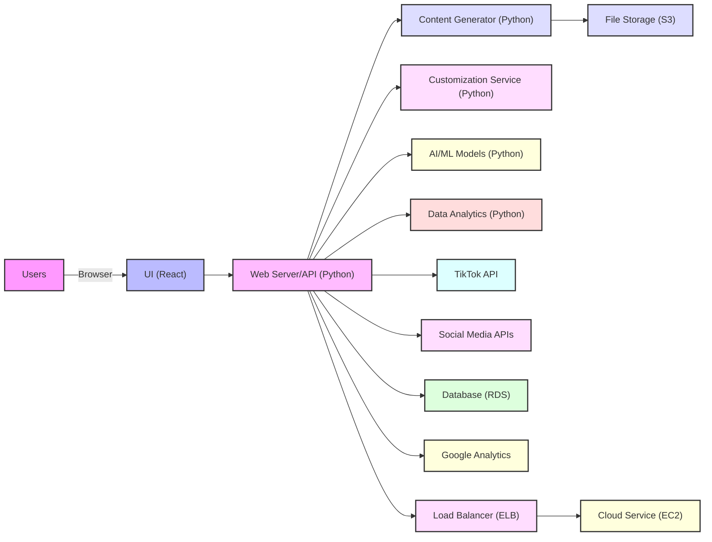
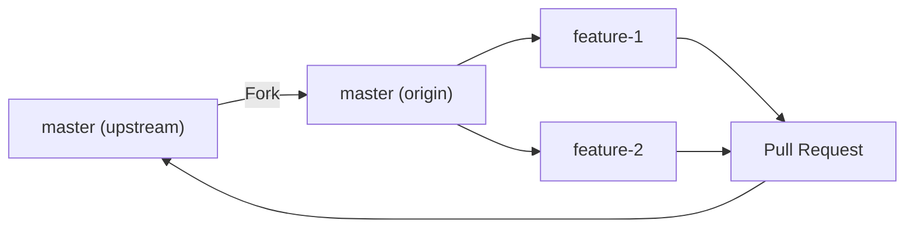
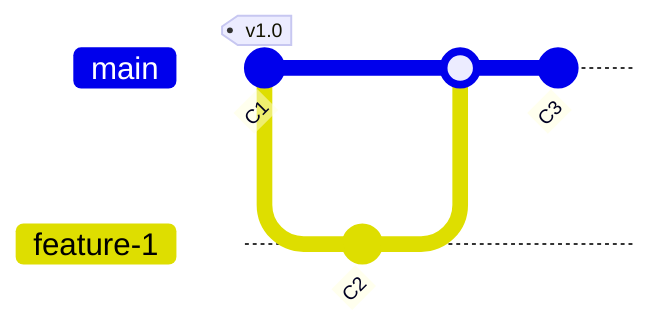

# GG





--------



```mermaid
gitGraph
    branch feature-2
    checkout feature-2
    commit id:"C4"
    checkout main
    merge feature-2
    commit id:"C5" tag:"v1.1"
```

```mermaid
gitGraph
    branch release
    checkout release
    commit id:"C6" tag:"v1.2-rc"
    checkout main
    merge release
```

```mermaid
gitGraph
    branch hotfix
    checkout hotfix
    commit id:"C7"
    checkout main
    merge hotfix
    commit id:"C8" tag:"v1.2.1"
```

```mermaid
gitGraph
    branch develop
    checkout develop
    commit id:"C9"
    commit id:"C10"
    checkout main
    merge develop
    commit id:"C11" tag:"v1.3"
```
